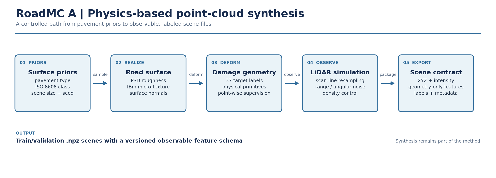
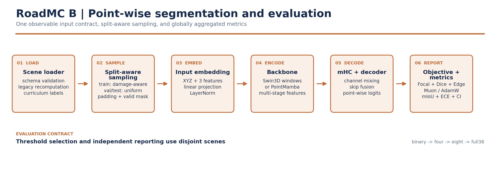

<div align="center">

# RoadMC

**Physics-grounded pavement point-cloud synthesis and damage segmentation**

Synthetic point clouds · observable geometry · Swin3D / PointMamba · mHC · Muon / AdamW

[中文](README.md)

</div>

> RoadMC is a research prototype for a reproducible path from physics-inspired pavement point-cloud synthesis to point-wise damage segmentation and real-domain diagnostics. The current reported evidence covers binary segmentation on synthetic data only.

## Project Scope

RoadMC has two equally important components:

1. **Point-cloud synthesis**: generates labeled pavement scenes from road roughness, micro-texture, damage geometry, and a LiDAR observation model.
2. **Model training**: predicts a damage class for every point from coordinates and sensor-observable features.

Synthetic data is part of the method, not merely preprocessing. It controls geometry, class coverage, rare-damage support, and the physical plausibility of the supervised training distribution.

## Method Overview

### A. Physics-based point-cloud synthesis

<p align="center">
  
</p>

Figure A moves from pavement priors through surface realization, damage deformation, LiDAR observation, and scene export. Point-wise labels originate with the geometry and follow observation resampling; observable features are computed only from the final points and intensity.

### B. Model training and evaluation

<p align="center">
  
</p>

Figure B moves from scene loading and split-aware sampling through input embedding, backbone encoding, mHC/decoding, and metric aggregation. The figures show module boundaries and data flow; the mathematical assumptions, feature definitions, and evaluation protocol are documented below:

```text
road morphology + damage deformation + LiDAR observation
        -> labeled scene files (.npz)
        -> observable input features
        -> Swin3D / PointMamba + mHC
        -> point-wise logits and global evaluation reports
```

## Current Status

| Item | Current status |
| --- | --- |
| Task | Binary segmentation: background `0` / damage `1` |
| Synthetic data | `4,995` scenes: `4,144` train and `851` validation |
| Points per scene | `2,048` |
| Current model | `Swin3D + mHC + Muon/AdamW` |
| Independent synthetic evaluation | Disease IoU / supported-class mIoU `0.7235` |
| Bootstrap 95% CI | `[0.7070, 0.7391]` |
| Automated tests | `34/34` passed |
| Real-domain status | Unlabeled domain-gap diagnostics only; no real semantic mIoU yet |

## Installation

The project requires Python `3.11+`. From the repository root:

```powershell
pip install -e .
```

Or with `uv`:

```powershell
uv sync
```

GPU training requires a PyTorch build compatible with the local CUDA driver. The current experiment used an RTX 5060 Laptop GPU with 8 GB VRAM and PyTorch `2.11.0+cu128`.

## 1. Point-Cloud Synthesis

### 1.1 Generative formulation

RoadMC represents a pavement scene as a continuous surface followed by a discrete sensor observation. A useful abstraction is:

$$
z(x,y) = z_{\text{rough}}(x,y) + z_{\text{texture}}(x,y) + \Delta z_{\text{damage}}(x,y).
$$

| Layer | Meaning | Implementation |
| --- | --- | --- |
| `z_rough` | Road roughness controlled by an ISO 8608 power spectrum | `roadmc/data/synthetic/config.py` |
| `z_texture` | fBm micro-texture, local curvature, and normal variation | `roadmc/data/synthetic/generator.py` |
| `damage` | Cracks, potholes, rutting, spalling, repairs, and joints | `roadmc/data/synthetic/primitives.py` |
| Observation | Scan-line resampling, range noise, angular jitter, and density control | `roadmc/data/synthetic/generator.py` |
| Labels | Point-wise JTG-style labels with binary and curriculum mappings | `roadmc/data/synthetic/labels.py` |

The generator first constructs the surface and damage deformation, then applies the observation model. This separates shape, labels, density, and noise sources instead of treating the scene as a regular grid with random perturbations.

### 1.2 Generate a dataset

```powershell
python roadmc/scripts/generate_synthetic.py `
  --train-count 2000 `
  --val-count 500 `
  --output-dir ./data/synthetic_output `
  --pavement mixed `
  --roughness B `
  --num-points 2048 `
  --workers 16
```

To extend an existing dataset, the script reuses existing scenes and fills missing files:

```powershell
python roadmc/scripts/expand_synthetic_dataset.py `
  --output-dir ./data/synthetic_output `
  --target-total 5000 `
  --num-points 2048 `
  --workers 16 `
  --pavement mixed `
  --roughness B
```

On Windows, start with `16` workers. Higher parallelism can increase page-file and memory pressure.

### 1.3 Controlled class budgets

Formal experiments should control both forced scenes and effective target-point counts per class, rather than only the total number of files:

```powershell
python roadmc/scripts/generate_class_budget.py `
  --output-dir ./data/credibility_v1_5k `
  --split both `
  --target-scenes-per-class 112 `
  --min-points-per-class 4000 `
  --grid-res 0.02 `
  --num-points 2048 `
  --workers 16 `
  --pavement mixed `
  --roughness B

python roadmc/scripts/validate_synthetic_dataset.py `
  --data-dir ./data/credibility_v1_5k `
  --split both `
  --feature-check-scenes 64 `
  --output-json ./output/data_validation.json
```

The budget generator is resumable and reports completion only after scene quotas, point quotas, and the feature contract all pass validation.

## 2. Model Training

### 2.1 Observable input contract

The model only receives quantities that can also be computed from a point cloud at inference time:

```text
roadmc.observable_features.v1
[normalized_intensity, pca_curvature, signed_local_height_residual]
```

- `normalized_intensity`: normalized LiDAR intensity.
- `pca_curvature`: the smallest eigenvalue of the local covariance divided by its trace, `lambda_min / trace(C)`.
- `signed_local_height_residual`: the signed orthogonal residual to a local PCA tangent plane, normalized by neighborhood support radius.

The same contract is used for synthetic scenes, legacy `.npz` files, and real point-cloud loading. Labels never participate in feature construction; the former label-derived `crack_boundary_dist` channel has been removed.

### 2.2 Network and objective

| Module | Choice | Role |
| --- | --- | --- |
| Backbone | `swin3d` | Windowed point-cloud Transformer with multi-stage features |
| Backbone | `pointmamba` | Morton-order point sequence mixer with lower memory cost |
| mHC | Enabled by default | Sinkhorn-style channel mixing for feature flow |
| Head | Per-point classifier | Produces point-wise class logits |
| Loss | Focal + Dice + supervised BEV Edge | Handles imbalance and adds boundary supervision |
| Optimizer | Hybrid Muon + AdamW | Muon for matrix parameters, AdamW for 1D parameters |

Validation and test splits use deterministic uniform sampling. Disease-aware sampling is training-only, preventing validation prevalence from being artificially rebalanced.

### 2.3 Binary training

The current RTX 5060 Laptop configuration is:

```powershell
python roadmc/train.py baseline `
  --data_dir ./data/credibility_v1_5k `
  --label_stage binary `
  --backbone swin3d `
  --optimizer muon `
  --batch_size 4 `
  --max_points 2048 `
  --embed_dim 48 `
  --depths 1 1 2 1 `
  --num_heads 3 3 6 6 `
  --window_size 32 `
  --max_epochs 5 `
  --num_workers 4 `
  --precision 16-mixed `
  --auto_class_weights `
  --metric_min_support 500
```

The default learning rate is `1e-2` for Muon and `1e-3` for AdamW; override it with `--lr`. If the active environment does not provide Muon, use `--optimizer adamw` explicitly.

For a short diagnostic run:

```powershell
python roadmc/scripts/quick_diagnose.py `
  --binary `
  --backbone pointmamba `
  --steps 200 `
  --batch_size 2 `
  --max_points 1024 `
  --binary_class_weights 1.0,3.0
```

### 2.4 Curriculum transfer to 38 classes

The supported label spaces are:

```text
binary -> four -> eight -> full38
```

Each stage reuses the backbone and mHC weights while reinitializing the task-specific classifier head:

```powershell
python roadmc/train.py baseline `
  --data_dir ./data/credibility_v1_5k `
  --label_stage four `
  --pretrained_checkpoint ./path/to/binary.ckpt `
  --backbone swin3d `
  --optimizer muon `
  --batch_size 4 `
  --max_points 2048 `
  --max_epochs 20 `
  --num_workers 4 `
  --precision 16-mixed
```

Binary results must not be used to infer 38-class performance. Every multi-class stage should report class support, per-class IoU, macro mIoU, and a confusion matrix separately.

## 3. Evaluation and Evidence

The evaluator supports global confusion matrices, threshold scanning, ECE, Brier score, NLL, and scene-block bootstrap intervals:

```powershell
python roadmc/evaluate.py `
  --checkpoint ./path/to/binary.ckpt `
  --data-dir ./data/credibility_v1_5k `
  --label-stage binary `
  --max-points 2048 `
  --scan-binary-thresholds `
  --threshold-calibration-scenes 170 `
  --bootstrap-samples 1000 `
  --output-json ./output/evaluation.json
```

Current medium-scale synthetic evidence:

- `4,144` training scenes and `851` validation scenes, with `2,048` points per scene.
- The first `170` validation scenes selected the threshold; the remaining `681` scenes formed the independent report.
- Independent Disease IoU / supported-class mIoU: `0.7235`.
- Precision / recall: `0.8874 / 0.7966`.
- ECE: `0.0020`.
- Scene-block bootstrap 95% CI: `[0.7070, 0.7391]`.

These numbers characterize binary performance on the current physics-inspired synthetic distribution. They are not claims of real-domain accuracy or 38-class quality.

## 4. Real Point Clouds and Domain Diagnostics

The real-data loader supports `.npy`, `.ply`, `.pcd`, `.las`, and `.laz` inputs and computes the same observable feature contract. JSON sidecars can record sensor, coordinate units, intensity scale, road segment, and provenance.

The current M2S-RoAD sample contains unlabeled PCD frames and is used for domain diagnostics only:

```powershell
python roadmc/scripts/diagnose_domain_gap.py `
  --source-dir ./data/credibility_v1_5k `
  --source-kind synthetic `
  --source-split val `
  --target-dir ./data/real/m2s_road_sample `
  --target-kind real `
  --target-pattern "*.pcd" `
  --target-ground-plane `
  --max-scenes 64 `
  --output-json ./output/domain_gap.json
```

The present diagnostics show a relatively small mismatch in local geometric residuals, with larger gaps in LiDAR density, intensity, and normal tilt. Until real labels and coordinate units are verified, domain-adaptation results must not be presented as real-domain mIoU.

## 5. Data Format

Each scene is stored as a compressed `.npz` file:

| Field | Shape | Description |
| --- | --- | --- |
| `points` | `(N, 3)` | XYZ coordinates |
| `labels` | `(N,)` | 38-class labels, mapped at curriculum time |
| `feats` | `(N, 3)` | The three observable-contract channels |
| `normals` | `(N, 3)` | Local surface normals |
| `valid_mask` | `(N,)` | Valid-point mask after padding |
| `pavement_type` | scalar | `asphalt`, `concrete`, or `mixed` |
| `feature_schema` | scalar | Must be `roadmc.observable_features.v1` |

## 6. 38-Class Label Space

`0` is background, `1-20` are asphalt pavement defects, and `21-37` are concrete pavement defects.

| ID | Class | ID | Class |
| --- | --- | --- | --- |
| 0 | Background | 1-8 | Crack families and severity levels |
| 9-10 | Pothole | 11-12 | Raveling |
| 13-14 | Depression | 15-16 | Rutting |
| 17-18 | Corrugation | 19 | Bleeding |
| 20 | Asphalt patching | 21-22 | Slab shatter |
| 23-24 | Concrete cracking | 25-26 | Corner break |
| 27-28 | Faulting | 29 | Pumping |
| 30-31 | Edge spall | 32-33 | Joint damage |
| 34 | Pitting | 35 | Blowup |
| 36 | Exposed aggregate | 37 | Concrete patching |

## 7. Repository Structure

```text
roadmc/
  data/
    class_balance.py       # effective class weights
    curriculum.py          # binary -> four -> eight -> full38
    dataloader.py
    features.py            # observable feature contract
    real/                  # real point-cloud loader and metadata
    synthetic/             # roughness, primitives, labels, generator
  models/
    attention/             # window attention
    backbone/              # Swin3D / PointMamba
    gan/                   # experimental generator and discriminator
    mhc/                   # mHC and spectral analysis
    model_pl.py
  scripts/                 # synthesis, validation, evaluation, diagnostics
  domain_gap.py
  metrics.py
  train.py
  evaluate.py
  test_*.py
readmeimage/
  synthesis_pipeline.png
  training_pipeline.png
```

## 8. Completed Work and Roadmap

### Completed

- Removed label-derived input and unified the observable feature contract across synthetic, legacy, and real point clouds.
- Fixed validation/test sampling bias and added deterministic evaluation, threshold calibration, and bootstrap confidence intervals.
- Added physical reachability for 38 labels, class budgets, automatic class weights, and curriculum transfer.
- Completed GPU binary validation with mHC on an RTX 5060 Laptop and forward/backward transfer smoke tests for the 4/8/38-class stages.
- Passed `34/34` automated tests and compilation checks.

### Next steps

1. Freeze the binary checkpoint and threshold, then create a truly independent synthetic test split.
2. Run controlled ablations of Swin3D, PointMamba, mHC, and Muon/AdamW under one evaluation protocol.
3. Train the `four`, `eight`, and `full38` curriculum stages and report each stage independently.
4. Acquire real road scans with reliable labels, coordinate units, and a verified JTG mapping.
5. Calibrate density and intensity in the real domain before evaluating domain randomization, GAN adaptation, or unsupervised adaptation.

## License

MIT. See [LICENSE](LICENSE).

<div align="center">

[中文](README.md)

</div>
