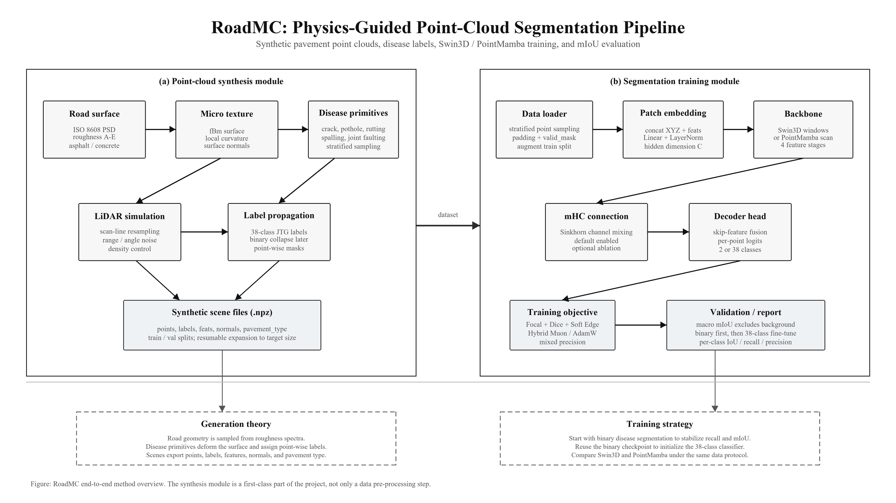

<div align="center">

# RoadMC

**Physics-based point-cloud synthesis + pavement defect segmentation**

Point-cloud generation theory · Swin3D / PointMamba · mHC · Muon / AdamW · Binary-to-38-class training

> [中文](README.md)

</div>

---

## Overview

RoadMC has two equally important parts:

1. **Point-cloud synthesis module**: generates labeled pavement point clouds from road roughness spectra, micro-texture, disease geometry primitives, and LiDAR observation models.
2. **Model training module**: trains per-point defect segmentation models with Swin3D or PointMamba, mHC, Focal/Dice/Edge losses, and Muon/AdamW optimization.

The current experimental path is binary first: background `0` versus disease `1`. Once binary mIoU is stable, the binary checkpoint can initialize the backbone for 38-class fine-tuning.

---

## Method Overview

<p align="center">
  
</p>

The left panel is the point-cloud synthesis module, and the right panel is the segmentation training module. The synthesis module is not merely data preprocessing: it determines geometry, label distribution, rare-defect coverage, and the upper bound of the supervised training data.

---

## Install

```powershell
pip install -e .
```

Or with `uv`:

```powershell
uv sync
```

---

## Point-Cloud Synthesis: Theory and Implementation

RoadMC does not generate random noisy point clouds. It constructs supervised data from pavement morphology, disease deformation, and sensor observation.

### Theoretical Components

| Component | Role | Current implementation |
| --- | --- | --- |
| Road surface | Provides global elevation and roughness | ISO 8608 PSD roughness spectrum, classes A-E |
| Micro-texture | Adds local detail and avoids over-smooth surfaces | fBm fractal surface, local curvature, normals |
| Disease primitives | Creates cracks, potholes, rutting, spalling, and related defects | `roadmc/data/synthetic/primitives.py` |
| LiDAR observation | Makes point clouds closer to scanned data than regular grids | scan-line resampling, range noise, angular jitter, density control |
| Label propagation | Converts defect regions into point-wise supervision | 38 JTG-style labels; dynamically collapsed for binary training |
| Scene export | Produces trainable `.npz` scenes | `points`, `labels`, `feats`, `normals`, `pavement_type` |

### Generate a New Dataset

```powershell
python roadmc/scripts/generate_synthetic.py `
  --train-count 2000 `
  --val-count 500 `
  --output-dir ./data/synthetic_output `
  --pavement mixed `
  --roughness B `
  --workers 8
```

### Expand an Existing Dataset

The expansion script is resume-friendly. It checks existing `scene_*.npz` files and only fills missing scenes.

```powershell
python roadmc/scripts/expand_synthetic_dataset.py `
  --output-dir ./data/synthetic_output `
  --target-total 5000 `
  --workers 16 `
  --num-points 8192 `
  --pavement mixed `
  --roughness B
```

On the current workstation, `16` workers is safer. `32` workers can create Windows page-file or memory pressure.

---

## Model Training: Structure and Strategy

The training module consumes synthetic point clouds and produces per-point logits. It supports both binary segmentation and 38-class semantic segmentation.

### Data Loading

`SyntheticPointCloudDataset` reads each `.npz` scene:

- `coords`: normalized XYZ coordinates.
- `feats`: intensity, curvature, crack-boundary distance.
- `labels`: 38-class labels; dynamically collapsed to `labels > 0` in binary mode.
- `valid_mask`: ignores padded points in loss and mIoU.

Sampling prioritizes disease points, reducing the chance of pure-background batches.

### Backbone and mHC

Available backbones:

| Backbone | Characteristics | Current use |
| --- | --- | --- |
| `swin3d` | Point-cloud Transformer with window attention | Stronger representation, higher VRAM pressure |
| `pointmamba` | Morton-order point sequence mixer | Lighter; useful for fast binary experiments |

mHC is enabled by default. It performs Sinkhorn-style channel mixing to improve deep feature flow. Add `--no_mhc` for ablations.

### Losses and Optimizer

Current objective:

```text
Loss = FocalLoss + DiceLoss + Soft EdgeLoss
```

- `FocalLoss`: handles heavy background-disease imbalance.
- `DiceLoss`: improves small and rare target regions.
- `Soft EdgeLoss`: adds differentiable boundary supervision.
- `val_mIoU`: macro mIoU excluding background, aligned with evaluation reports.

The default optimizer is hybrid `Muon + AdamW`:

- 2D matrix parameters use Muon.
- bias, norm, scalar, and other 1D parameters use AdamW.
- If the active PyTorch build lacks `torch.optim.Muon`, use `--optimizer adamw`.

### Binary Training

```powershell
python roadmc/train.py baseline `
  --data_dir ./data/synthetic_output `
  --binary `
  --backbone pointmamba `
  --optimizer muon `
  --batch_size 2 `
  --max_points 2048 `
  --max_epochs 20 `
  --num_workers 4 `
  --precision 16-mixed `
  --binary_class_weights 1.0,3.0
```

Fast diagnostic run:

```powershell
python roadmc/scripts/quick_diagnose.py `
  --binary `
  --backbone pointmamba `
  --steps 200 `
  --batch_size 2 `
  --max_points 1024 `
  --binary_class_weights 1.0,3.0
```

### Returning to 38 Classes

After binary training is stable, initialize the backbone from a binary checkpoint and train a fresh 38-class classifier head:

```powershell
python roadmc/train.py baseline `
  --data_dir ./data/synthetic_output `
  --pretrained_binary ./lightning_logs/version_X/checkpoints/best.ckpt `
  --backbone pointmamba `
  --optimizer muon `
  --batch_size 2 `
  --max_points 2048 `
  --max_epochs 50 `
  --num_workers 4 `
  --precision 16-mixed
```

For direct 38-class training, omit `--binary`:

```powershell
python roadmc/train.py baseline --data_dir ./data/synthetic_output --backbone pointmamba
```

---

## Evaluation

For 38-class checkpoints:

```powershell
python roadmc/evaluate.py `
  --checkpoint ./lightning_logs/version_X/checkpoints/best.ckpt `
  --data_dir ./data/synthetic_output `
  --output_json ./eval_report.json
```

During binary experiments, monitor training `val_mIoU` or run `quick_diagnose.py` for short validation runs.

---

## Data Format

Each scene is a compressed `.npz` file:

| Field | Shape | Description |
| --- | --- | --- |
| `points` | `(N, 3)` | XYZ coordinates |
| `labels` | `(N,)` | 38-class labels, dynamically collapsed in binary mode |
| `feats` | `(N, 3)` | Intensity, curvature, crack-boundary distance |
| `normals` | `(N, 3)` | Surface normals |
| `pavement_type` | scalar | `asphalt`, `concrete`, or mixed-generation result |

---

## 38 Labels

`0` is background. `1-20` are asphalt pavement defects, and `21-37` are concrete pavement defects.

| ID | Class |
| --- | --- |
| 0 | Background |
| 1-8 | Crack families: alligator, block, longitudinal, transverse, with severity levels |
| 9-10 | Pothole |
| 11-12 | Raveling |
| 13-14 | Depression |
| 15-16 | Rutting |
| 17-18 | Corrugation |
| 19 | Bleeding |
| 20 | Patching, asphalt |
| 21-22 | Slab shatter |
| 23-24 | Concrete crack |
| 25-26 | Corner break |
| 27-28 | Faulting |
| 29 | Pumping |
| 30-31 | Edge spall |
| 32-33 | Joint damage |
| 34 | Pitting |
| 35 | Blowup |
| 36 | Exposed aggregate |
| 37 | Patching, concrete |

---

## Project Structure

```text
roadmc/
  data/
    dataloader.py
    real/dataset.py
    synthetic/
      config.py
      generator.py
      primitives.py
  models/
    attention/window_attention.py
    backbone/
      swin3d.py
      pointmamba.py
    gan/
      generator.py
      discriminator.py
    mhc/
      mhc.py
      spectral_analysis.py
    model_pl.py
  scripts/
    generate_synthetic.py
    expand_synthetic_dataset.py
    quick_diagnose.py
    grid_search_binary.py
  train.py
  evaluate.py
readmeimage/
  model_architecture.png
```

---

## Current Experimental Roadmap

1. Expand the synthetic dataset to roughly 5000 scenes.
2. Improve binary `val_mIoU` to the `0.7-0.9` range.
3. Compare `pointmamba` and `swin3d`, prioritizing stable GPU memory and faster convergence.
4. Transfer from binary to 38-class training with `--pretrained_binary`.
5. Revisit GAN domain adaptation and real point-cloud loading.

---

## License

MIT. See [LICENSE](LICENSE).

<div align="center">

> [中文](README.md)

</div>
