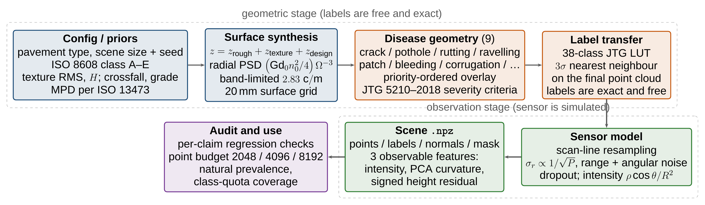
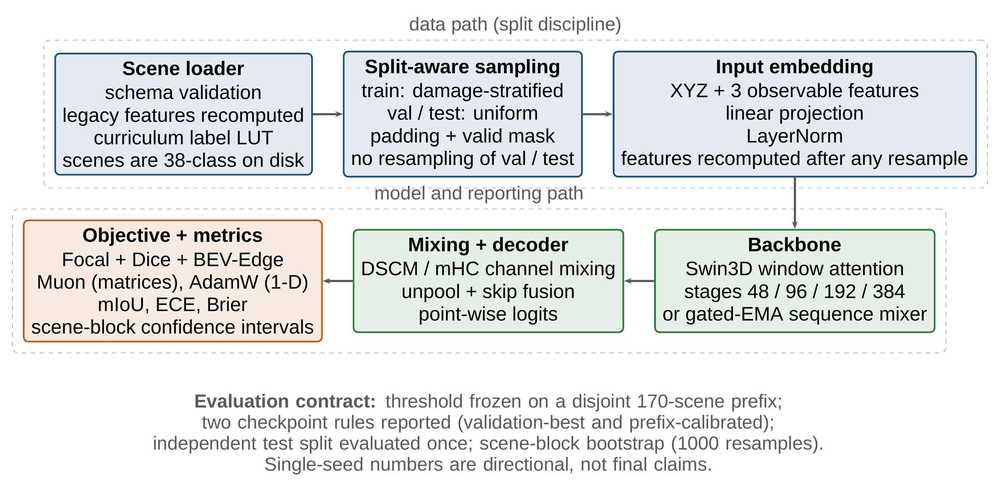

<div align="center">

# RoadMC

**Physics-grounded pavement point-cloud synthesis and damage segmentation**

Synthetic point clouds · observable geometry · Swin3D / PointMamba · mHC · Muon / AdamW

[中文](README.md)

</div>

> RoadMC is a research prototype for a reproducible path from physics-inspired pavement point-cloud synthesis to point-wise damage segmentation and real-domain diagnostics. The current reported evidence covers binary segmentation on synthetic data only.

## Project Scope

RoadMC has two equally important components:

1. **Point-cloud synthesis**: generates labeled pavement scenes from road roughness, micro-texture, damage geometry, and a LiDAR observation model.
2. **Model training**: predicts a damage class for every point from coordinates and sensor-observable features.

Synthetic data is part of the method, not merely preprocessing. It controls geometry, class coverage, rare-damage support, and the physical plausibility of the supervised training distribution.

## Method Overview

### Physics-based point-cloud synthesis

<p align="center">
  
</p>

The synthesis pipeline moves from pavement priors through surface realization, damage deformation, LiDAR observation, and scene export. Point-wise labels originate with the geometry and follow observation resampling; controlled scenes sample their target class at natural prevalence with only a minimum-survival floor, and every intervention is written to audit metadata. Observable features are computed only from the final points and intensity.

### Model training and evaluation

<p align="center">
  
</p>

The training pipeline moves from scene loading and split-aware sampling through input embedding, backbone encoding, mHC/decoding, and metric aggregation:

```text
road morphology + damage deformation + LiDAR observation
        -> labeled scene files (.npz)
        -> observable input features
        -> Swin3D / PointMamba + mHC
        -> point-wise logits and global evaluation reports
```

## Current Status

| Item | Current status |
| --- | --- |
| Task | Binary segmentation: background `0` / damage `1` |
| Generator | Natural-prevalence sampling + resolution/protection audit contract (2026-07) |
| Historical baseline | Disease IoU `0.7235`, produced by the removed fixed-10%-quota generator — **no longer valid evidence** |
| Current baseline | v2 rebuild in progress: natural-prevalence data + independent train/val/test |
| Current model | `Swin3D + mHC + Muon/AdamW` |
| Automated tests | `52/52` passed |
| Real-domain status | Unlabeled domain-gap diagnostics only; no real semantic mIoU yet |

## Installation

The project requires Python `3.11+`. From the repository root:

```powershell
pip install -e .
```

Or with `uv`:

```powershell
uv sync
```

GPU training requires a PyTorch build compatible with the local CUDA driver. The current experiment used an RTX 5060 Laptop GPU with 8 GB VRAM and PyTorch `2.11.0+cu128`.

## Point-Cloud Synthesis

### Generative formulation

RoadMC represents a pavement scene as a continuous surface followed by a discrete sensor observation:

$$
z(x,y) = z_{\text{rough}}(x,y) + z_{\text{texture}}(x,y) + \Delta z_{\text{damage}}(x,y).
$$

| Layer | Meaning | Implementation |
| --- | --- | --- |
| `z_rough` | Road roughness controlled by an ISO 8608 power spectrum | `roadmc/data/synthetic/config.py` |
| `z_texture` | fBm micro-texture, local curvature, and normal variation | `roadmc/data/synthetic/generator.py` |
| `damage` | Cracks, potholes, rutting, spalling, repairs, and joints | `roadmc/data/synthetic/primitives.py` |
| Observation | Scan-line resampling, range/angular noise, natural-prevalence output sampling | `roadmc/data/synthetic/generator.py` |
| Labels | Point-wise JTG-style labels with binary and curriculum mappings | `roadmc/data/synthetic/labels.py` |

The generator first constructs the surface and damage deformation, then applies the observation model. It explicitly separates three resolutions: the physical surface grid spacing (`--surface-grid-spacing`, default `0.005 m`), the sensor output point count (`--num-points`), and the downstream model input budget. Millimetre-scale surface grids do not automatically survive into the final cloud; each scene records all three resolutions and the protection-sampling audit in `resolution_metadata_json`.

### Generating a dataset

```powershell
python roadmc/scripts/generate_synthetic.py `
  --train-count 2000 `
  --val-count 500 `
  --output-dir ./data/synthetic_output `
  --pavement mixed `
  --roughness B `
  --num-points 2048 `
  --workers 16
```

At the default `5 mm` surface grid each worker peaks at several hundred MiB; the script prints the resolution summary and the aggregate parallel-memory estimate before starting, and refuses to run past the `--max-parallel-memory-mib` budget. To extend an existing dataset, the expansion script reuses existing scenes, validates that the recorded `grid_res` matches (preventing mixed-resolution splits), and fills the missing files:

```powershell
python roadmc/scripts/expand_synthetic_dataset.py `
  --output-dir ./data/synthetic_output `
  --target-total 5000 `
  --num-points 2048 `
  --workers 16 `
  --pavement mixed `
  --roughness B
```

### Controlled class budgets

Formal experiments should control both forced scenes and effective target-point counts per class, rather than only the total number of files:

```powershell
python roadmc/scripts/generate_class_budget.py `
  --output-dir ./data/credibility_v2 `
  --split both `
  --target-scenes-per-class 112 `
  --min-points-per-class 4000 `
  --num-points 2048 `
  --workers 16 `
  --pavement mixed `
  --roughness B

python roadmc/scripts/validate_synthetic_dataset.py `
  --data-dir ./data/credibility_v2 `
  --split both `
  --feature-check-scenes 64 `
  --output-json ./output/data_validation.json
```

The budget generator is resumable and reports completion only after scene quotas, point quotas, and the feature contract all pass validation. Three behaviors matter for statistical validity:

- Controlled scenes no longer pin the target-class point ratio; the per-scene survival floor is derived as `ceil(min-points / target-scenes)`, can be overridden with `--target-label-min-output-points`, and every protection intervention is written to the scene audit record.
- The script refuses to resume into directories containing pre-contract (old-quota-era) scenes, so two sampling regimes cannot silently mix inside one dataset; `--ignore-legacy-scenes` excludes them explicitly.
- Multi-worker runs validate the aggregate memory budget before generation starts.

## Model Training

### Observable input contract

The model only receives quantities that can also be computed from a point cloud at inference time:

```text
roadmc.observable_features.v1
[normalized_intensity, pca_curvature, signed_local_height_residual]
```

- `normalized_intensity`: normalized LiDAR intensity.
- `pca_curvature`: the smallest eigenvalue of the local covariance divided by its trace, `lambda_min / trace(C)`.
- `signed_local_height_residual`: the signed orthogonal residual to a local PCA tangent plane, normalized by neighborhood support radius.

The same contract is used for synthetic scenes, legacy `.npz` files, and real point-cloud loading. Labels never participate in feature construction; the former label-derived `crack_boundary_dist` channel has been removed.

### Network and objective

| Module | Choice | Role |
| --- | --- | --- |
| Backbone | `swin3d` | Windowed point-cloud Transformer with multi-stage features |
| Backbone | `pointmamba` | Morton-order point sequence mixer with lower memory cost |
| mHC | Enabled by default | Sinkhorn-style channel mixing for feature flow |
| Head | Per-point classifier | Produces point-wise class logits |
| Loss | Focal + Dice + supervised BEV Edge | Handles imbalance and adds boundary supervision |
| Optimizer | Hybrid Muon + AdamW | Muon for matrix parameters, AdamW for 1D parameters |

Validation and test splits use deterministic uniform sampling. Disease-aware sampling is training-only, preventing validation prevalence from being artificially rebalanced.

### Binary training

The current RTX 5060 Laptop reference configuration:

```powershell
python roadmc/train.py baseline `
  --data_dir ./data/credibility_v2 `
  --label_stage binary `
  --backbone swin3d `
  --optimizer muon `
  --batch_size 4 `
  --max_points 2048 `
  --embed_dim 48 `
  --depths 1 1 2 1 `
  --num_heads 3 3 6 6 `
  --window_size 32 `
  --max_epochs 5 `
  --num_workers 4 `
  --precision 16-mixed `
  --auto_class_weights `
  --metric_min_support 500
```

The default learning rate is `1e-2` for Muon and `1e-3` for AdamW; override it with `--lr`. If the active environment does not provide Muon, use `--optimizer adamw` explicitly.

For a short diagnostic run:

```powershell
python roadmc/scripts/quick_diagnose.py `
  --binary `
  --backbone pointmamba `
  --steps 200 `
  --batch_size 2 `
  --max_points 1024 `
  --binary_class_weights 1.0,3.0
```

### Curriculum transfer to 38 classes

The supported label spaces are:

```text
binary -> four -> eight -> full38
```

Each stage reuses the backbone and mHC weights while reinitializing the task-specific classifier head:

```powershell
python roadmc/train.py baseline `
  --data_dir ./data/credibility_v2 `
  --label_stage four `
  --pretrained_checkpoint ./path/to/binary.ckpt `
  --backbone swin3d `
  --optimizer muon `
  --batch_size 4 `
  --max_points 2048 `
  --max_epochs 20 `
  --num_workers 4 `
  --precision 16-mixed
```

Binary results must not be used to infer 38-class performance; every multi-class stage reports class support, per-class IoU, macro mIoU, and a confusion matrix separately.

## Evaluation and Evidence

The evaluator supports global confusion matrices, threshold scanning, ECE, Brier score, NLL, and scene-block bootstrap intervals:

```powershell
python roadmc/evaluate.py `
  --checkpoint ./path/to/binary.ckpt `
  --data-dir ./data/credibility_v2 `
  --label-stage binary `
  --max-points 2048 `
  --scan-binary-thresholds `
  --threshold-calibration-scenes 170 `
  --bootstrap-samples 1000 `
  --output-json ./output/evaluation.json
```

**Historical baseline (superseded).** The pre-2026-07 binary evidence — independent Disease IoU `0.7235`, precision/recall `0.8874 / 0.7966`, ECE `0.0020`, bootstrap 95% CI `[0.7070, 0.7391]` — was produced by an earlier generator that force-retained roughly `10%` target-class points in every controlled scene. Validation prevalence was therefore artificially pinned, which contaminates IoU, calibration metrics, and threshold selection alike. That quota has been removed in favor of natural-prevalence sampling with an audited minimum-survival floor. The numbers above are kept for the historical record only and are no longer presented as current performance. Baseline v2 will be rebuilt on natural-prevalence data with an independent test split; its IoU is expected to be lower — a correction, not a regression.

## Real Point Clouds and Domain Diagnostics

The real-data loader supports `.npy`, `.ply`, `.pcd`, `.las`, and `.laz` inputs and computes the same observable feature contract. JSON sidecars can record sensor, coordinate units, intensity scale, road segment, and provenance.

The current M2S-RoAD sample contains unlabeled PCD frames and is used for domain diagnostics only:

```powershell
python roadmc/scripts/diagnose_domain_gap.py `
  --source-dir ./data/credibility_v2 `
  --source-kind synthetic `
  --source-split val `
  --target-dir ./data/real/m2s_road_sample `
  --target-kind real `
  --target-pattern "*.pcd" `
  --target-ground-plane `
  --max-scenes 64 `
  --output-json ./output/domain_gap.json
```

The present diagnostics show a relatively small mismatch in local geometric residuals; the remaining gaps are in LiDAR density, intensity, and normal tilt — all of them sensor-observation-layer quantities. The next step is therefore calibrating the generator's scan density and intensity physics, not jumping to GAN-based or unsupervised domain adaptation.

## Data Format

Each scene is stored as a compressed `.npz` file:

| Field | Shape | Description |
| --- | --- | --- |
| `points` | `(N, 3)` | XYZ coordinates (normalized; invertible via center/scale) |
| `labels` | `(N,)` | 38-class labels, mapped at curriculum time |
| `feats` | `(N, 3)` | The three observable-contract channels |
| `normals` | `(N, 3)` | Local surface normals |
| `pavement_type` | scalar | `asphalt`, `concrete`, or `mixed` |
| `feature_schema` | scalar | Must be `roadmc.observable_features.v1` |
| `coordinate_center` / `coordinate_scale` | `(3,)` / scalar | Invertible coordinate normalization |
| `resolution_metadata_json` | scalar | Three-tier resolution contract + target-label protection audit (JSON) |
| `surface_grid_spacing_m` etc. | scalar | Surface grid spacing/shape/count, sensor output count, model target points |

## 38-Class Label Space

`0` is background, `1-20` are asphalt pavement defects, and `21-37` are concrete pavement defects.

| ID | Class | ID | Class |
| --- | --- | --- | --- |
| 0 | Background | 1-8 | Crack families and severity levels |
| 9-10 | Pothole | 11-12 | Raveling |
| 13-14 | Depression | 15-16 | Rutting |
| 17-18 | Corrugation | 19 | Bleeding |
| 20 | Asphalt patching | 21-22 | Slab shatter |
| 23-24 | Concrete cracking | 25-26 | Corner break |
| 27-28 | Faulting | 29 | Pumping |
| 30-31 | Edge spall | 32-33 | Joint damage |
| 34 | Pitting | 35 | Blowup |
| 36 | Exposed aggregate | 37 | Concrete patching |

## Repository Structure

```text
roadmc/
  data/
    class_balance.py       # effective class weights
    curriculum.py          # binary -> four -> eight -> full38
    dataloader.py
    features.py            # observable feature contract
    patches.py             # metric-coordinate patch extraction (high-res track)
    real/                  # real point-cloud loader and metadata
    synthetic/             # roughness, primitives, labels, generator
  models/
    attention/             # window attention
    backbone/              # Swin3D / PointMamba
    gan/                   # experimental generator and discriminator (frozen)
    mhc/                   # mHC and spectral analysis
    model_pl.py
  scripts/                 # synthesis, validation, evaluation, diagnostics
  domain_gap.py
  metrics.py
  train.py
  evaluate.py
  test_*.py
readmeimage/
  synthesis_pipeline.png
  training_pipeline.png
```

## Completed Work and Roadmap

### Completed

- Removed label-derived input and unified the observable feature contract across synthetic, legacy, and real point clouds.
- Fixed validation/test sampling bias and added deterministic evaluation, threshold calibration, and bootstrap confidence intervals.
- Removed the fixed 10% target-class quota in controlled scenes in favor of natural-prevalence sampling with a minimum-survival floor; every protection intervention is written to per-scene audit metadata.
- Established the three-tier resolution contract (surface grid / sensor output / model input) with pre-generation memory budgeting; generation scripts refuse mixed-regime or mixed-resolution resumes.
- Implemented metric-coordinate patch extraction (not yet wired into training).
- Completed GPU binary validation with mHC on an RTX 5060 Laptop and transfer smoke tests for the 4/8/38-class stages.
- `52/52` automated tests pass.

### Roadmap

1. Rebuild a credible binary baseline v2 on natural-prevalence data: independent train/val/test splits, threshold selection on val, a single CI-reported evaluation on test.
2. Run Swin3D / PointMamba × mHC × Muon/AdamW ablations under one protocol on the frozen v2 data.
3. Wire in the patch pipeline and run the `2048 / 4096 / 8192 / 16384` input-density ablation (bootstrap aggregated by source scene).
4. Calibrate the sensor layer (scan density, intensity physics) to close the remaining domain-gap terms.
5. Acquire real road scans with reliable labels, coordinate units, and a verified JTG mapping before evaluating domain randomization or adaptation.

## License

MIT. See [LICENSE](LICENSE).

<div align="center">

[中文](README.md)

</div>
