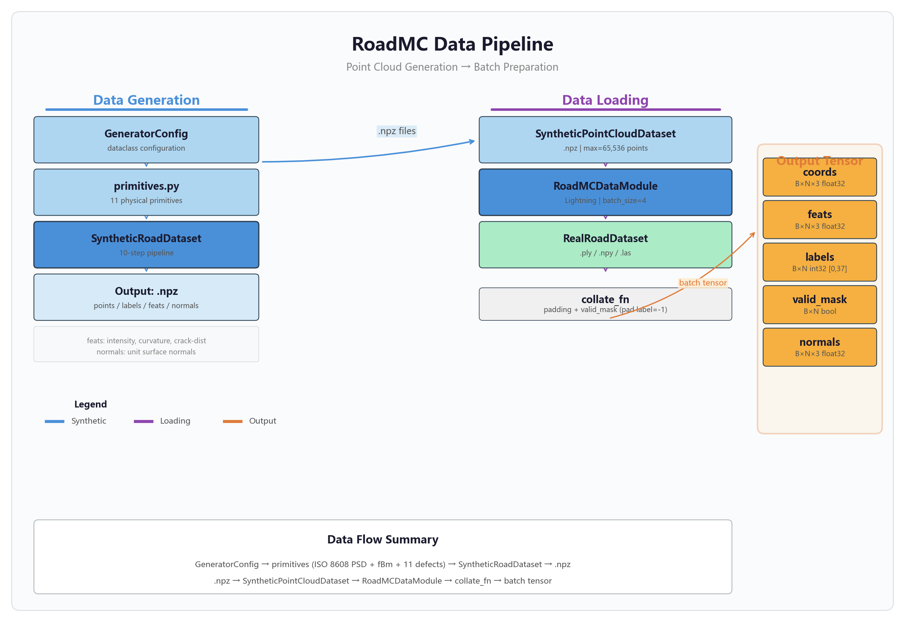
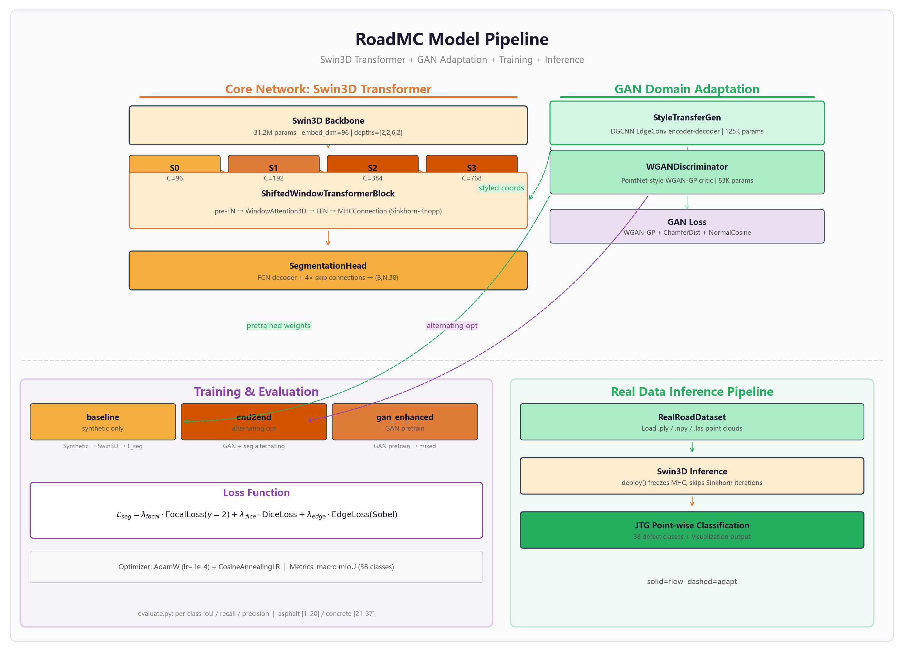

<div align="center">

# RoadMC

**物理仿真驱动的路面点云病害检测系统**

*严格遵循 JTG 5210-2018《公路技术状况评定标准》*

[](https://python.org)
[](https://pytorch.org)
[](LICENSE)
[]()

<br>

> [**English**](README.en.md)

</div>

---

## 系统架构

### 数据管线

<p align="center">
  
</p>

### 模型管线

<p align="center">
  
</p>

---

## 流水线概览

| 阶段 | 核心组件 | 输出 |
|:----:|----------|------|
| 1. 数据生成 | ISO 8608 PSD + fBm + 11 种病害基元 | `.npz` 点云场景 |
| 2. 核心网络 | Swin3D Transformer + mHC 通道混合 | 逐点分类 logits |
| 3. GAN 适配 | DGCNN 生成器 + WGAN-GP 判别器 | 风格迁移点云 |
| 4. 数据加载 | Lightning DataModule + 动态 padding | 训练/验证/测试 batch |
| 5. 训练评估 | AdamW + FocalLoss + DiceLoss + EdgeLoss | 38 类分割模型 |

**骨干网络**: Swin3D (4 阶段, depths=[2,2,6,2], embed_dim=96, 31.2M 参数). **mHC**: 基于 Sinkhorn-Knopp 的双随机通道混合 ([arXiv:2512.24880](https://arxiv.org/abs/2512.24880)). **GAN**: StyleTransferGen (125K 参数) + WGANDiscriminator (83K 参数). **损失函数**: FocalLoss(gamma=2) + DiceLoss + EdgeLoss (Sobel 3x3). **优化器**: AdamW(lr=1e-4) + CosineAnnealingLR. **类别**: 38 个 JTG 5210-2018 标签 (20 沥青 + 17 水泥 + 背景).

---

## 快速开始

### 环境配置

```bash
uv sync
```

### 自检验证

每个模块包含 `__main__` 块，运行断言测试。

```bash
# 阶段 1: 数据管线
python roadmc/data/synthetic/config.py
python roadmc/data/synthetic/primitives.py
python roadmc/data/synthetic/generator.py

# 阶段 2: 核心网络
python roadmc/models/mhc/mhc.py
python roadmc/models/attention/window_attention.py
python -m roadmc.models.backbone.swin3d
python roadmc/models/model_pl.py

# 阶段 3: GAN
python roadmc/models/gan/generator.py
python roadmc/models/gan/discriminator.py

# 阶段 4: 数据加载
python roadmc/data/dataloader.py
python roadmc/data/real/dataset.py

# 阶段 5: 训练管线
python roadmc/train.py              # 导入 + 形状检查
python roadmc/models/mhc/spectral_analysis.py

# 可视化
python roadmc/test/test_visualize.py
```

### 批量生成合成数据

```bash
python -m roadmc.scripts.generate_synthetic \
    --train-count 2000 --val-count 500 \
    --grid-res 0.01 --roughness B
```

---

## 数据格式

合成 `.npz` 字段:

| 字段 | 形状 | 类型 | 说明 |
|------|------|------|------|
| `points` | (N, 3) | float32 | XYZ 坐标 |
| `labels` | (N,) | int32 | JTG 5210-2018 标签 [0, 37] |
| `feats` | (N, 3) | float32 | 强度、曲率、裂缝边界距离 |
| `normals` | (N, 3) | float32 | 单位法向量 |
| `pavement_type` | - | str | `"asphalt"` 或 `"concrete"` |

```python
import numpy as np
data = np.load("scene_0000.npz", allow_pickle=True)
points = data["points"]   # (N, 3) float32
labels = data["labels"]   # (N,) int32
```

---

## 训练

三种模式，通过 `roadmc/train.py` 启动:

| 模式 | 命令 | 说明 |
|:----:|------|------|
| baseline | `python roadmc/train.py baseline` | 仅合成数据训练分割模型 |
| gan_enhanced | `python roadmc/train.py gan_enhanced` | GAN 预训练 + 风格混合训练 |
| end2end | `python roadmc/train.py end2end` | GAN + 分割交替优化 |

```bash
python roadmc/train.py baseline --data_dir ./data/synthetic_output --max_epochs 50
```

---

## 评估

逐类 IoU、召回率、精确率，覆盖全部 38 个 JTG 标签，按路面类型分组 (沥青 [1-20]，水泥 [21-37])。输出格式化终端表格和 JSON 报告。

```bash
python roadmc/evaluate.py --checkpoint ./lightning_logs/version_X/checkpoints/best.ckpt
```

---

## 项目结构

```
roadmc/
├── data/
│   ├── synthetic/
│   │   ├── config.py              # GeneratorConfig 数据类 (443 行)
│   │   ├── primitives.py          # 11 个物理基元 (2020+ 行)
│   │   └── generator.py           # SyntheticRoadDataset (1100+ 行)
│   └── real/
│       └── dataset.py             # 真实 .ply/.npy/.las 加载器 (stub)
├── models/
│   ├── backbone/swin3d.py         # 4 阶段 Swin3D Transformer
│   ├── attention/                 # WindowAttention3D + Deformable
│   ├── mhc/mhc.py                 # MHCConnection (Sinkhorn-Knopp)
│   ├── gan/
│   │   ├── generator.py           # StyleTransferGen (125K 参数)
│   │   └── discriminator.py       # WGANDiscriminator (83K 参数)
│   └── model_pl.py                # LightningModule + FocalLoss + DiceLoss + EdgeLoss
├── scripts/
│   └── generate_synthetic.py      # 批量 .npz 生成 CLI
├── test/
│   ├── test_visualize.py          # 13 张诊断 PNG 输出
│   └── output/                    # 生成图片
├── train.py                       # 训练入口
├── evaluate.py                    # 逐类 IoU/召回率/精确率
├── run.py                         # 交互式菜单
└── docs/
    ├── data_pipeline.png          # 数据管线图
    ├── model_pipeline.png         # 模型管线图
    └── architecture.png           # 完整系统架构图
```

---

## 引用

```bibtex
@misc{roadmc2026,
  author = {YQGHL},
  title = {RoadMC: 物理仿真驱动的路面点云病害检测系统},
  year = {2026},
  howpublished = {\url{https://github.com/YQGHL/roadmc}}
}
```

---

## 许可

MIT. 详见 [LICENSE](LICENSE).

---

<div align="center">

> [**English**](README.en.md)

</div>
