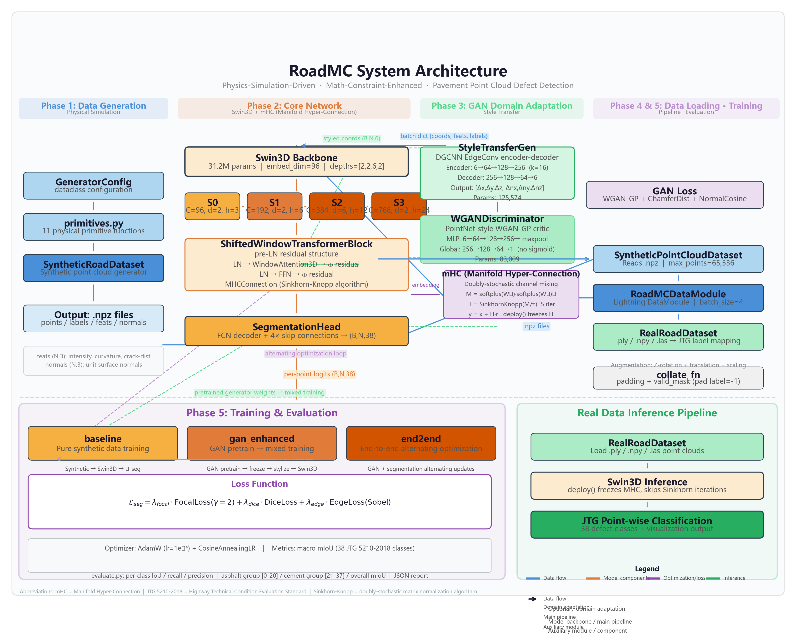
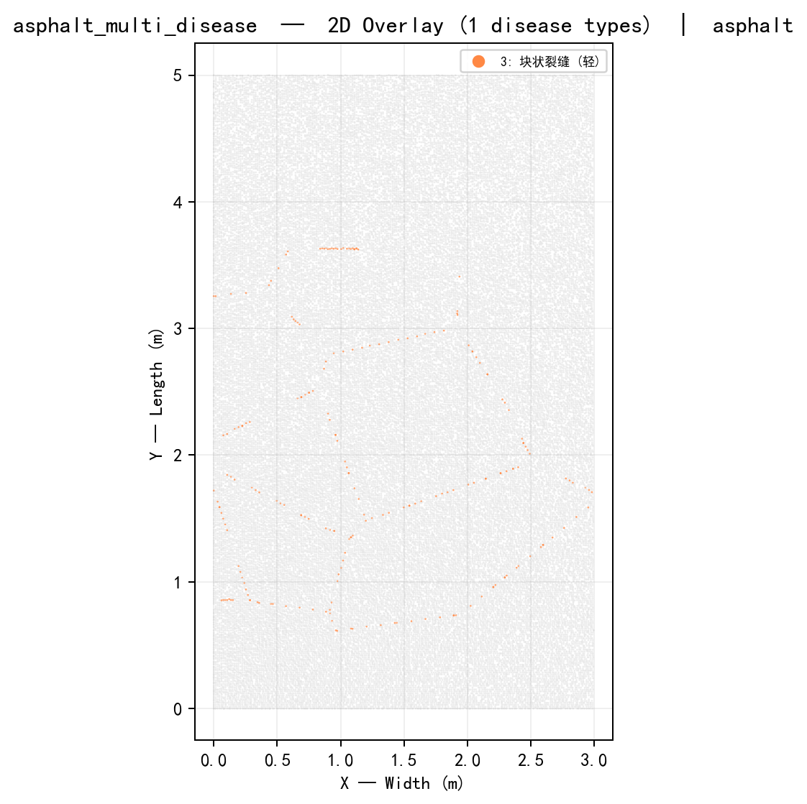
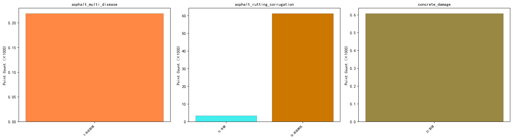

<div align="center">

# 🛣️ RoadMC

**物理仿真驱动 · 数学约束增强 · 路面点云病害检测**

*严格遵循 JTG 5210—2018《公路技术状况评定标准》*

[](https://python.org)
[](https://pytorch.org)
[](LICENSE)
[]()

<br>

> [**English**](README.en.md)

_物理保真度 · 数学严谨性 · 工程精度 · 管线完整_

</div>

---

## 📋 目录

- [项目简介](#-项目简介)
- [系统架构](#-系统架构)
- [阶段一：物理仿真数据生成](#-阶段一物理仿真数据生成)
- [阶段二：深度网络模型](#-阶段二深度网络模型)
- [阶段三：GAN 域适应](#-阶段三gan-域适应)
- [阶段四：数据加载](#-阶段四数据加载)
- [阶段五：训练与评估](#-阶段五训练与评估)
- [快速开始](#-快速开始)
- [数据格式](#-数据格式)
- [可视化](#-可视化)
- [项目结构](#-项目结构)
- [许可与引用](#-许可与引用)

---

## 🌄 项目简介

RoadMC 是一个**物理仿真驱动、数学约束增强**的路面点云病害检测系统。它通过高保真物理仿真生成合成训练数据，并采用**Swin3D Transformer**架构结合**流形约束超连接 (mHC)**实现逐点语义分割。

**核心特性：**

- **物理保真：** ISO 8608 功率谱密度路面合成，11 种力学精确的病害模型（裂缝、坑槽、车辙等）
- **数学严谨：** Sinkhorn-Knopp 双随机通道混合、Sobel 正则化边缘损失、PCA 曲率估计
- **标准合规：** 完整遵循 **JTG 5210—2018** 分类体系，覆盖沥青/水泥路面共 38 个病害标签
- **完整管线：** 从数据生成到模型训练再到评估指标

---

## 🏗 系统架构

<p align="center">
  
  <br>
  <em>图：RoadMC 完整系统架构（阶段 1-5）— 数据生成 → 数据加载 → 核心网络(Swin3D+mHC) → GAN域适应 → 训练评估</em>
</p>

---

## 🔬 阶段一：物理仿真数据生成

### 数据管线

| 步骤 | 组件 | 数学模型 |
|:----:|------|----------|
| ① | 路面类型选择 | 概率驱动 (沥青/水泥) |
| ② | 路面轮廓生成 | **ISO 8608 PSD** + 逆 FFT 谱合成 |
| ③ | LiDAR 扫描线重采样 | 高斯扫描线衰减 + 距离衰减 |
| ④ | 微观纹理叠加 | **fBm** 分数布朗运动 |
| ⑤ | 病害组合应用 | 11 种病害 + 标签优先级裁决 |
| ⑥ | 曲率计算 | PCA 特征值比 $\lambda_{\min} / \Sigma\lambda$ |
| ⑦ | LiDAR 噪声仿真 | 球坐标噪声 + Bernoulli 丢点 |
| ⑧ | 标签传递 | KDTree 最近邻 + 3σ 距离阈值 |
| ⑨ | 体素下采样 | 2D 网格体素平均 |
| ⑩ | 坐标归一化 | 平移至原点 + 单位球缩放 |

### 病害模型

| 病害 | 数学模型 | 标签 |
|------|----------|:----:|
| 裂缝 (4 种) | Bézier 曲线 + Perlin 噪声 + Voronoi 图 | 1–8 |
| 坑槽 | 超椭圆凹陷 $z(r) = -d[1-(r/R)^\beta]^{1/\beta}$ | 9–10 |
| 松散 | 随机移除 + 高斯侵蚀 | 11–12 |
| 沉陷 | 高斯凹陷 | 13–14 |
| 车辙 | 双高斯轮迹 + 正弦纵向调制 | 15–16 |
| 波浪拥包 | 正弦调制 | 17–18 |
| 泛油 | 仅修改标签 | 19 |
| 水泥损坏 (10 种) | Voronoi 碎裂、错台、剥落、拱起等 | 21–37 |

### 代码审查

| 优先级 | 修复数 | 说明 | 状态 |
|:------:|:------:|------|:----:|
| 🔴 P0 | 4 | 裂缝宽度插值、强度时序、松散标签、KDTree 阈值 | ✅ |
| 🟠 P1 | 6 | 扫描线密度、体素下采样、标签优先级、水泥偏移、死代码、强度模型 | ✅ |
| 🟡 P2 | 4 | Voronoi 裁剪、KDTree 曲率、边缘混合可配置、软标签 | ✅ |

---

## 🧠 阶段二：深度网络模型

### 流形约束超连接 (mHC)

学习一个**双随机通道混合矩阵**，通过 Sinkhorn-Knopp 算法实现：

$$M = \text{softplus}(W_1) \cdot \text{softplus}(W_2)^\top \in \mathbb{R}^{C \times C}$$

$$H = \text{SinkhornKnopp}(M / \tau), \quad H \cdot \mathbf{1} = \mathbf{1},\; \mathbf{1}^\top \cdot H = \mathbf{1}^\top$$

$$y = x + H \cdot r \in \mathbb{R}^{B \times C}$$

`deploy()` 可将 $H$ 冻结为静态矩阵，推理时跳过 Sinkhorn 迭代。

> 📄 **mHC 论文**: [arXiv:2512.24880](https://arxiv.org/abs/2512.24880)

### Transformer Block

采用**前归一化 (pre-LN)** 残差结构：

```python
x_norm = LN(x)
x_attn = 窗口注意力(x_norm) + x          # pre-LN 残差
x_ffn = LN(x_attn)
x_ffn = FFN(x_ffn) + x_attn              # pre-LN 残差
x_out = MHC(x_ffn, x_attn)               # mHC 通道混合
```

### Swin3D 骨干网络

| 阶段 | 通道数 | 深度 | 头数 | 输出 |
|:----:|:------:|:----:|:----:|:----:|
| 0 | 96 | 2 | 3 | $(B,N,96)$ |
| 1 | 192 | 2 | 6 | $(B,N,192)$ |
| 2 | 384 | 6 | 12 | $(B,N,384)$ |
| 3 | 768 | 2 | 24 | $(B,N,768)$ |

**参数量**: 3.5M (轻量) / 31.2M (完整)

### 损失函数

$$\mathcal{L} = \lambda_1 \cdot \text{FocalLoss}(\gamma=2,\alpha) + \lambda_2 \cdot \text{DiceLoss} + \lambda_3 \cdot \mathcal{L}_{\text{edge}}$$

---

## 🎨 阶段三：GAN 域适应

### 生成器 (`models/gan/generator.py`)
DGCNN 风格迁移编码器-解码器架构：
- **EdgeConv**: `torch.cdist` 构建 k-NN 图，MLP 聚合边特征
- **编码器**: 3× EdgeConv (6→64→128→256, k=16)
- **解码器**: 3× Linear (256→128→64→6)，输出坐标残差 + 法向调整
- **参数量**: 125,574

### 判别器 (`models/gan/discriminator.py`)
PointNet 风格 WGAN-GP 判别器：
- 逐点 MLP → 最大池化 → 全局 MLP → (B,1) 逻辑值（无 sigmoid）
- 无 BatchNorm（WGAN-GP 要求）
- **参数量**: 83,009

### 损失函数
$$\mathcal{L}_{\text{GAN}} = \mathcal{L}_{\text{WGAN-GP}} + \lambda_{\text{CD}} \cdot \text{ChamferDist} + \lambda_{\text{NC}} \cdot (1 - \cos(\mathbf{n}_{\text{pred}}, \mathbf{n}_{\text{ref}}))$$

---

## 📦 阶段四：数据加载

### DataLoader (`data/dataloader.py`)
- `SyntheticPointCloudDataset` — 加载 `.npz` 文件，支持 `max_points` 下采样
- `RoadMCDataModule` — Lightning DataModule，支持 train/val/test
- `collate_pointcloud_batch` — 自动 padding + `valid_mask`（填充标签为 -1，忽略损失计算）
- 数据增强：Z 轴旋转 + 平移 + 缩放

### 真实数据 (`data/real/dataset.py`)
- `RealRoadDataset` — 加载 `.ply`/`.npy` 格式的真实点云
- JTG 5210-2018 标签映射接口
- 坐标归一化

---

## 🚀 阶段五：训练与评估

### 训练 (`train.py`)
三种模式：
| 模式 | 命令 | 说明 |
|:----:|------|------|
| `baseline` | `python train.py baseline` | 纯合成数据训练分割模型 |
| `gan_enhanced` | `python train.py gan_enhanced` | GAN 预训练 → 风格迁移混合训练 |
| `end2end` | `python train.py end2end` | GAN + 分割交替优化 |

### 评估 (`evaluate.py`)
- 每类 IoU / 召回率 / 精确率（38 个 JTG 标签）
- 按沥青路面 [1-20] / 水泥路面 [21-37] 分组统计
- JSON 报告输出 + 终端格式化表格

### MHC 谱分析 (`models/mhc/spectral_analysis.py`)
- 验证双随机矩阵的谱范数 ≤ 1
- 模拟 60 层级联传播的能量比
- SVD 特征值分解

---

## 🚀 快速开始

### 环境配置

```bash
pip install numpy scipy torch matplotlib pytorch-lightning torchmetrics
```

### 自检验证

```bash
# 阶段一 — 数据管线
python roadmc/data/synthetic/config.py           # ✓ 配置检查
python roadmc/data/synthetic/primitives.py       # ✓ 13 个物理基元
python roadmc/data/synthetic/generator.py        # ✓ 场景生成 (5/5)

# 阶段二 — 网络模型
python roadmc/models/mhc/mhc.py                 # ✓ mHC 超连接
python roadmc/models/attention/window_attention.py  # ✓ 3D 注意力
python -m roadmc.models.backbone.swin3d          # ✓ Swin3D 骨干
python roadmc/models/model_pl.py                 # ✓ Lightning 封装

# 阶段三 — GAN
python roadmc/models/gan/generator.py           # ✓ 风格迁移生成器
python roadmc/models/gan/discriminator.py       # ✓ WGAN-GP 判别器

# 阶段四 — 数据加载
python roadmc/data/dataloader.py                # ✓ DataLoader
python roadmc/data/real/dataset.py              # ✓ 真实数据集

# 阶段五 — 训练管线
python -c "from roadmc.train import *"          # ✓ 训练导入

# 光谱分析
python roadmc/models/mhc/spectral_analysis.py   # ✓ MHC 谱分析

# 可视化
python roadmc/test/test_visualize.py            # 输出 13 张 PNG
```

### 批量生成合成数据

```bash
python -m roadmc.scripts.generate_synthetic \
    --train-count 2000 --val-count 500 \
    --grid-res 0.01 --roughness B
```

---

## 📦 数据格式

### 合成点云 (.npz)

| 字段 | 形状 | 类型 | 说明 |
|------|------|------|------|
| `points` | $(N,3)$ | `float32` | 三维坐标 $(x,y,z)$ |
| `labels` | $(N,)$ | `int32` | JTG 5210-2018 标签 $[0,37]$ |
| `feats` | $(N,3)$ | `float32` | 强度、曲率、裂缝边界距离 |
| `normals` | $(N,3)$ | `float32` | 单位法向量 |
| `pavement_type` | — | `str` | `'asphalt'` 或 `'concrete'` |

```python
import numpy as np
data = np.load("scene_0000.npz", allow_pickle=True)
points = data["points"]   # (N, 3) float32
labels = data["labels"]   # (N,) int32
```

---

## 🎨 可视化

测试套件生成 13 张 PNG 图：

| 图片 | 内容 |
|------|------|
| `*_2d_overlay.png` | 俯视图 + JTG 标签着色 |
| `*_grayscale_height.png` | 高度图 + 等高线 + 纵剖面 |
| `*_3d.png` | 3D 曲面网格 + 法向量 |
| `*_features.png` | 强度/曲率/裂缝距离特征通道 |
| `label_statistics.png` | 标签分布统计 |

<p align="center">
  
  
  <br>
  <em>左：病害种类标签着色俯视图  右：各类标签分布统计</em>
</p>

---

## 📁 项目结构

```
roadmc/
├── data/
│   ├── synthetic/
│   │   ├── config.py               # 数据类配置 (~500 行)
│   │   ├── primitives.py           # 13 个物理基元 (~2020 行)
│   │   └── generator.py            # 合成数据集 (~1100 行)
│   └── real/
│       └── dataset.py              # 真实点云加载 (阶段四)
├── models/
│   ├── mhc/mhc.py                  # mHC 超连接 + Sinkhorn-Knopp
│   ├── attention/                  # 3D 窗口注意力 + 可变形
│   ├── backbone/swin3d.py          # 4 阶段 Swin3D Transformer
│   ├── gan/
│   │   ├── generator.py            # StyleTransferGen (阶段三)
│   │   └── discriminator.py        # WGANDiscriminator (阶段三)
│   └── model_pl.py                 # PyTorch Lightning 封装
├── scripts/
│   └── generate_synthetic.py       # CLI 批量生成
├── test/
│   ├── test_visualize.py           # 可视化 (13 张图)
│   └── output/                     # 生成图片
├── train.py                        # 训练入口 (阶段五)
├── evaluate.py                     # 评估入口 (阶段五)
├── README.md                       # 本文档
├── LICENSE                         # MIT License
├── .gitignore
└── pyproject.toml
```

---

## 📄 许可与引用

**许可协议**: MIT © 2026 YQGHL。详见 [LICENSE](LICENSE)。

**引用格式**：

```bibtex
@misc{roadmc2026,
  author = {YQGHL},
  title = {RoadMC: 物理仿真驱动的路面点云病害检测系统},
  year = {2026},
  howpublished = {\url{https://github.com/YQGHL/roadmc}}
}
```

---

<div align="center">

_从物理仿真到逐点分类_

[**English**](README.en.md) · **中文版**

</div>
